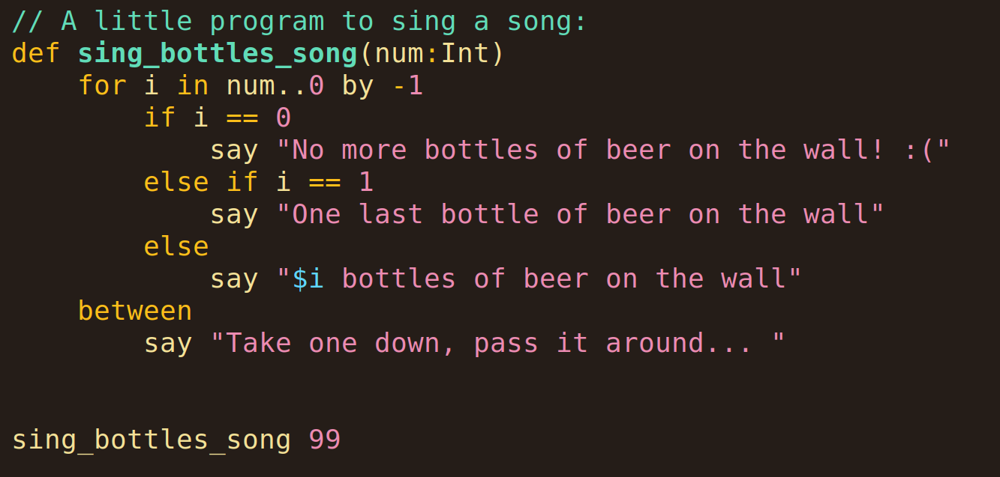

# The SSS Programming Language

SSS is a language that prioritizes **s**implicity, **s**afety, and **s**peed,
with lightweight syntax and garbage collection. It's statically typed,
compiled, and imperative. It uses [libgccjit](https://gcc.gnu.org/wiki/JIT) as
a backend, which compiles to a binary. SSS lets you write SSS-tier software.

## Example

See [docs/quickstart.sss](docs/quickstart.sss) for a quick rundown of the
language, or see [the test folder](test/) for more comprehensive examples of
each feature.

## Dependencies

The SSS compiler is written in C and uses
[libgccjit](https://gcc.gnu.org/onlinedocs/jit/) as the backend for
compilation. SSS also uses the [Boehm garbage
collector](https://www.hboehm.info/gc/) for runtime garbage collection. (both
are available from your package manager of choice, for example: `pacman -S
libgccjit gc`). The compiler uses a few GCC extensions, so other C compilers
are not supported.

## Usage

To build the compiler, simply run `make`. To install the compiler run `sudo
make install`.

The REPL can be run by running the command `sss` (or `./sss` in this
directory). SSS files can be run directly via `sss myprogram.sss`, compiled
to a static executable via `sss -c myprogram.sss -o myprogram`, or compiled to a
library module via `sss -c myprogram.sss -o libmyprogram.so`.

Additional command line arguments can be found in the manpages (`man
./sss.1`) or by running `sss --help`.

## Language Features

[See docs/features.md for writeups of some of the features in SSS.](docs/features.md) These include:

- Simple value semantics and mutability rules
- Memory safety (GC, compiler-enforced null pointer checks, and automatic array bounds checking)
- Simple type system with type inference
- Type-safe DSL strings
- Units of measure
- Better loops
- Vectorized math operations
- Low-overhead datastructures
- Structs, not OOP
- Module system
- Semantic versioning
- Built-in doctests with syntax highlighting
- Useful built-in types: arrays, tables, tuples, structs, tagged unions
- Percentages

## Usage

Once the necessary dependencies are installed, you can run `./sss` to get a
REPL or use `./sss your-file.sss` to run a file directly or `./sss -c
your-file.sss` to compile it into a binary called `your-file`. See `sss --help`
for full usage info.

## License

SSS is released under the MIT license with the Commons Clause, see
[LICENSE](LICENSE) for full details.
